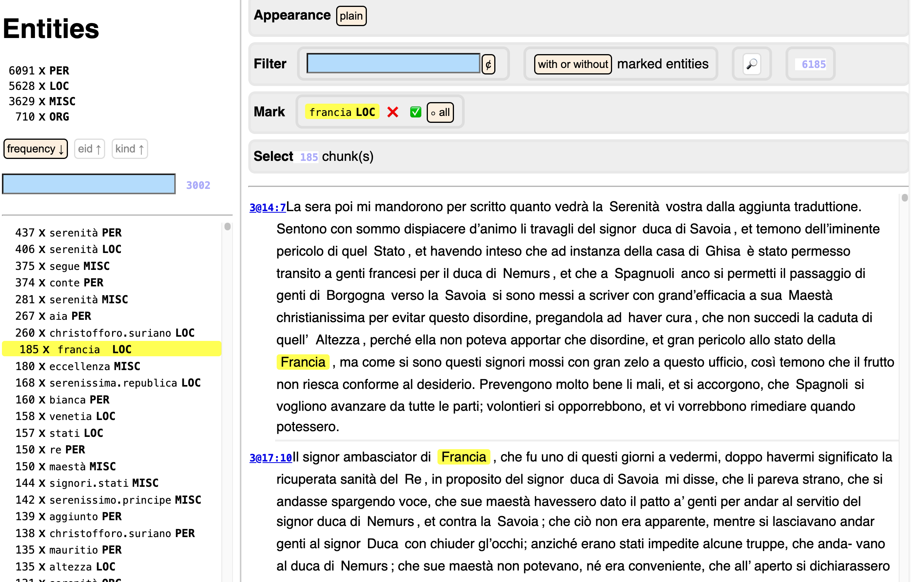
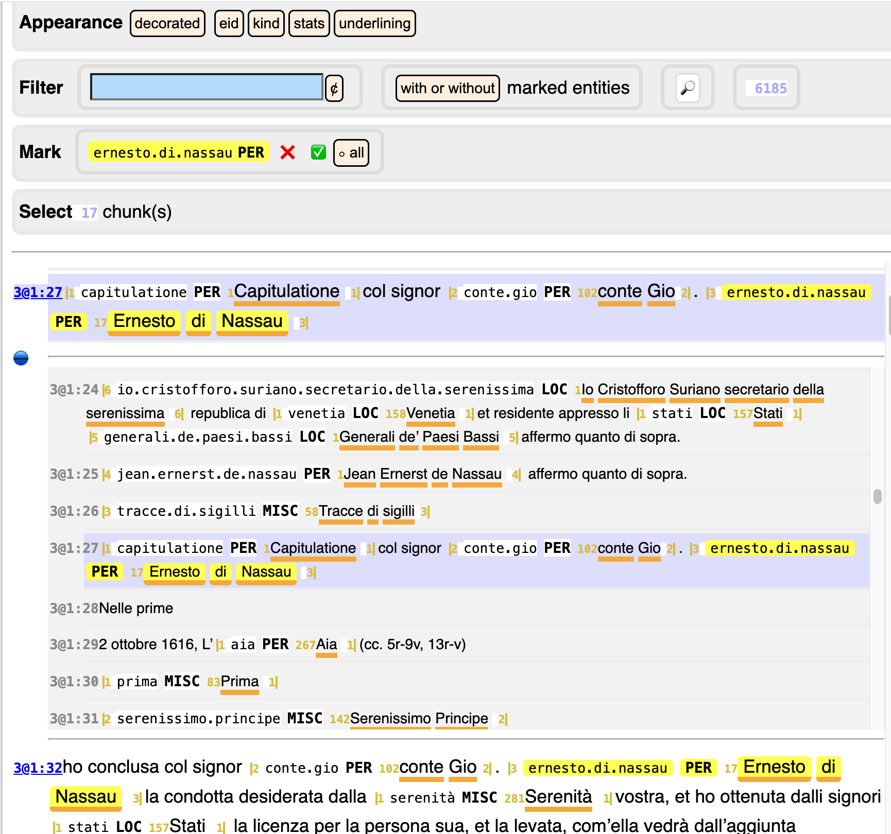
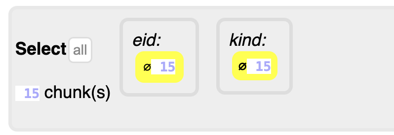
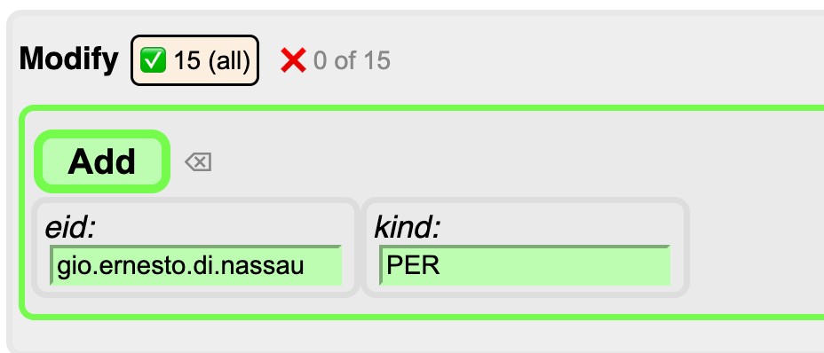
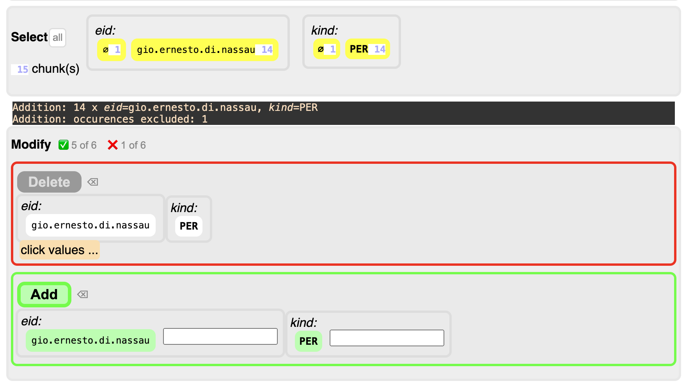
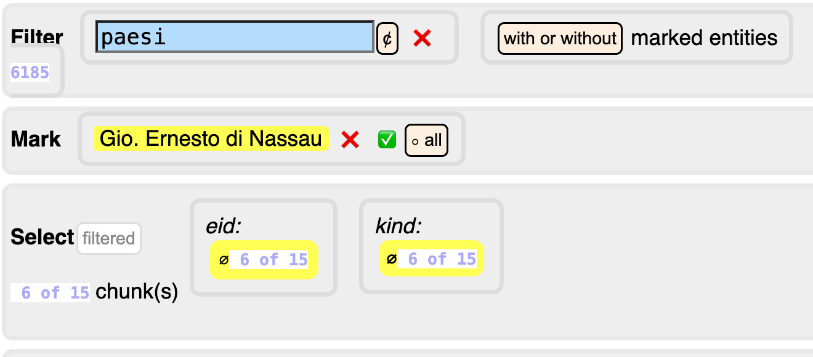

# Annotate tool in TF Browser

We explain the manual annotation process with a leading example:
[HuygensING/suriano](https://github.com/HuygensING/suriano).

## Prerequisites

*   [Python](https://www.python.org) must be installed;
*   You must know how to start up a terminal
    (macos or linux) or command prompt (windows);
*   Text-Fabric must be installed: in a terminal or command prompt say

    ```
    pip install text-fabric
    ```

    On some systems you have to say `pip3` instead of `pip`.
    If by chance you already have an older version of text-fabric,
    say

    ```
    pip install --upgrade text-fabric
    ```

## Start up

Start a terminal or command prompt.
You need not go to a specific directory.
Give the command

```
tf HuygensING/suriano --tool=ner --chrome
```

The tool opens in a new window in the Chrome browser.
Currently the tool works best in Chrome, but it is not required.
If you leave out the `--chrome` bit, the tool starts in your default browser.

If you have the tool open, and you want/need to restart it, say

```
tf HuygensING/suriano --tool=ner --chrome -noweb
```

then it will not open a new browser window and you can continue in the
already open browser tab.

The start-up window looks like this:


*   **Left column**:

    manage annotation *sets*. Your work ends up in an annotation set.
    Here you can choose in which set.

    You can create a new, empty set or duplicate an existing set.
    You can also rename a set or delete it.

    There is one special set, here it is called `ent-nodes`.
    These are the entities that are already in the corpus.
    This is a read-only set. You can inspect it, but you cannot add annotations
    or modify its annotations.

    However, you can duplicate this set, and the copy can be modified.
    So, if the existing set is a good one, requiring only a few tweaks,
    this is a good way to start.

*   **Entities column**:
    
    see the entities in the chosen set.

    At the top you see an overview of the kinds of entities and how many entities
    there are of each kind.

    At the bottom is the list of all entities, which you can filter and sort by the
    controls in between.

    You can click on each entity. Let's click on `Francia`:

    

    On the right you see all occurrences of this entity, highlighted.

*   **Right column**:

    see a list of buckets (i.e. paragrpahs in this corpus).

    If you have clicked on an entity, you see the buckets that contain an occurrence
    of that entity.

    If you have not clicked on anything, you see the whole corpus, truncated to the
    first 100 buckets.

    We got here by clicking on an entity. If we click the ❌ next to the entity on top,
    we reset the viewer.

    From this point, we can do a succession of steps.


## Annotation workflow

### Viewing text

We focus on the right column in the initial view, without anything highlighted.

On top you see a section **Appearance** with a button `plain`.
Click that button. It changes to `decorated` plus a row of buttons next to it.

Below, in the text, you see that something has changed:


*   every occurrence of an entity in the set is now underlined;
*   the whole entity is wrapped between `|` with a little number indicating how
    many tokens the occurrence has.
*   right before each occurrence there is a small number: it indicates how many
    occurrences there are of that entity;
*   reading to the right, you see `LOC` or `PER` orv`MISC`: the kind of the entity;
*   further to the right you see the identifier of the entity;
    if you click on the identifier, you load all of its occurrences, to the same
    effect as when you had it clicked it from the Entities column.
*   you can hide these pieces of information selectively, by clicking in the
    row of buttons above (`eid`, `kind`, `stats`, `underlining`).

Click an identifier in order to load all its occurrences, e.g. `ernesto.di.nassau`.
If you need more context around an occurrence, click the blue section indicator
at the left of the relevant paragraph.

You will get a scrollable view of the whole section (letter) in which that paragraph
occurs. 



The paragraph you started from is in the center. You can scroll up and down the
whole letter that the paragraph is contained in.
If you want to return to the paragraph you started from, click the blue dot.
If you want to remove the context, click the blue section indicator again.

### Finding occurrences

Suppose you want to find occurrences of `Gio. Erneso di Nassau` and mark them all
as named entities with the same identifier. You can achieve that in the following
steps:

1.  **Make a new set**

    First of all you should create a set where your new annotations will end up.
    In the right column, click the `+` button and enter a name for the new set,
    e.g. `test`.

1.  **Filter step**
    
    In the filter box, type `ernesto` and then click the 🔎 button.
    The text view now shows only the paragraphs with `ernesto` in it, and it shows
    *all* of them in the whole corpus.

1.  **Mark step**

    Now click the word `Gio` and then click the subsequent `Nassau`, both around
    `Ernesto`.
    The whole stretch `Gio. Ernesto di Nassau` becomes yellow highlighted.
    Above the text you see a new control section, titled **Mark**:

    

    Click the ✅ button that you see there.

    The text below will contain all paragraphs in which the string
    `Gio. Ernesto di Nassau` occurs, with all those occurrences highlighted.
    There are 15 of them.

    Moreover two more control sections will show up.

1.  **Select step**

    The yellow occurrences might be instances of other entities. If so, the select step
    shows you the identifiers and kinds of those entities.
    You may select values here in order to restrict the modification actions in the
    next step to these cases. 

    

    You also see the values `⌀`: they select occurrences that are *not* instances
    of any entity in the currently developed set.
    Since we just started with an empty set, these are the only values that you can
    select, and the app has already selected them for you.


1. **Modify step**

    Now you can act on the selected occurrences. There are two possible actions:
    *add* entitiies for these occurrences or *delete* existing entities for these
    occurrences. Since our set of entities is still empty, we can only add.

    

    You have to tell the annotator the values for the entity identifier and kind that
    you will assign. The tool has already prefilled sensible values for you, but you 
    can change them.

    Before you click `add`, click on the ✅ button after the first occurrence.
    That will deselect this occurrence from the `add` operation.
    More about that below.

    The result looks like this:

    

    (the first occurrence is unaffected)

    

    (new entity markings show up!).

    Also the control sections look different now:

    

    Note the the lines with the black background: they report the result of the
    previous action.

    The **select** control now shows additional values under the selected occurrences:
    the identifier and kind of the entity markings we have just added.

    The **modify** control shows the `delete` action: we can remove the entities
    we just added.

    In order to do so, we have to click on the values that we want to delete,
    and then press the delete button. If we do that,
    we have effectively undone the previous addition.

Using a succession of these steps, it is possible to assign entity information to many
occurrences using only a few steps.

But it is not always enough to crudely assign entities to all occurrences of a pattern.
And sometimes you want to modify existing entities, and give them a different kind,
but not all of them.
For those reasons, there is a bit more sophistication built into the tool.

## Sophistication

**Filter step**

There is a button `with or without`, which changes to `with` and `without`.
This enables you to filter the paragraphs that contain entities, or the paragraphs
that do not contain entities.

**Mark step**

There is a button `all` that changes to `free` and `intersecting`.
This enables you to mark only occurrences that do not overlap with existing entities,
or occurrences that do overlap with existing entities.

**Select step**

There is a button `all`. If you click on it, it changes
to `filtered`, and you see the totals as `15 of 15` instead of `15`.


What does this mean?

You can work with the `filtered` paragraphs only (the ones that contain the word
`ernesto`, marked as blue), or you can work with all paragraphs, including the ones
that are not in the filtered view.
In this case, both options coincide, because the filter pattern `ernesto` is also
part of the entity pattern `Gio. Ernesto di Nassau`.

If you replace `ernesto` by `paesi` in the filter, you'll see this:



Now you see that when you choose `filtered`, you act on 6 occurrences, instead
of all 15.

**Modify step**

Before you click the `add` or `delete` buttons, you can fine tune things, by further
selecting or deselecting specific occurrences that should be affected.

All occurrences of the candidate entity that are shown in the paragraphs below
have a ✅ button after them. If you click it, it turns into a ❌ button,
and the occurrence becomes deselected. The `add` operation will forego this
occurrence and leave it unaffected.
You can also select or deselect all occurrences in one go.

**N.B.**
If you have filtered the paragraphs, and under **select** you have chosen to work with
`all` results, (de)selecting only works for the occurrences in the filtered paragraphs.
The other results are not (de)selectable, and will all be affected.

**Several surface forms for one entity**

If you have added an entity, and you mark another one, you'll see a new button next to
the ✅, namely ❎. It has mostly the same effect, namely marking all occurrences
in the corpus, but the differences are in what happens below the `add` button.
Whereas the ✅ button fills the eid field with a value derived from the occurrence,
the ❎ leaves the previous value unchanged. So you can just click `add` to mark
the new occurrences with the values of the same entity as before.

# More power

The workflow sketched above works fine if you know what to look for, and if there are
not too many distinct named entities in the corpus.

Probably you soon discover that there are quite a bit of distinct named entities,
and each entity has quite a bit of surface forms.
Then the work load may not feel doable anymore.

For that purpose, there is also a *power* annotate mode, where you run the
annotator tool in a Jupyter Notebook, driven by a spreadsheet with names and
surface forms.

See `tf.browser.ner.power`.

You can then still use this tool after the fact to check the entity assignments
and make fine-tuning corrections.
