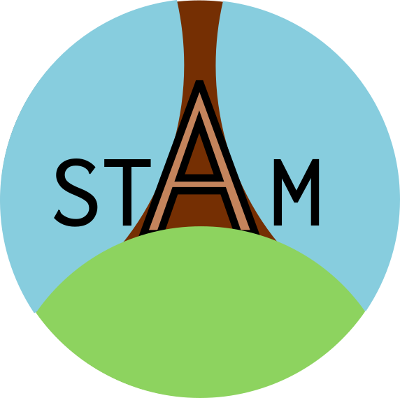

# Excursion: STAM

[Maarten van Gompel](https://github.com/proycon)
has created the software library
[STAM](https://github.com/annotation/stam)
and uses it (among other use cases) to build a
[pipeline](https://github.com/knaw-huc/brieven-van-hooft-pipeline/blob/main/README.md)
from a corpus of letters by P.C. Hooft in Folia format to text segments and
web annotations.

We now have two sytems,
[STAM](https://github.com/annotation/stam)
and Text-Fabric that can untangle text and markup.
They are implemented very differently, and have a different flavour, but at the
same time they share the preference of separating the textual data from all the data
around the text.

*   *intent*

    *   **STAM**: make it easier for tools and infrastructure to handle texts with
    annotations.
    *   **TF**: support researchers in analysing textual corpora.

*   *implementation*

    *   **STAM**: Rust + [Python bindings](https://github.com/annotation/stam-python).
    *   **TF**: Pure Python.

*   *organization*

    *   **STAM**: very neatly in a core with extensions.
    *   **TF**: core data functionality in `tf.core` modules, search functionality in
        `tf.search` modules, lots of other functions are included in the code with
        varying degrees of integration and orderliness!

*   *standards*

    *   **STAM**: actively seeks to interoperate with existing standards, but
        internally it uses its own way of organizing the data.
    *   **TF**: also relies on a few simple conventions w.r.t. data
        organization and efficient serialization. These conventions are
        documented. It has several import and export functions, e.g. from TEI,
        PageXML, MQL, and to MQL, TSV. But it prefers to input and output data
        in minimalistic streams, without the often redundant strings that are
        attached to standard formats.

*   *model*

    *   **STAM**: very generic w.r.t. annotations, annotations can target
        annotations and /or text segments.
    *   **TF**:
        [graph model](https://annotation.github.io/text-fabric/tf/about/datamodel.html)
        where nodes stand for textual positions and subsets of them, nodes and
        edges can have features, which are the raw material of annotations, but
        annotations are not a TF concept.

*   *query language*

    *   **STAM**:
        [STAMQL](https://github.com/annotation/stam/tree/master/extensions/stam-query),
        evolving as an SQL-like language, with user-friendly primitives for
        annotations.
    *   **TF**:
        [TF-Query](https://annotation.github.io/text-fabric/tf/about/searchusage.html),
        a noise-free language for graph templates with reasonable performance.

*   *display*

    *   **STAM**: In development, see `stam view` in
        [STAM tools](https://github.com/annotation/stam-tools).
    *   **TF**: Powerful functions to display corpus fragments with highlighting in
        `tf.advanced`. The challenge is to build generic display functions that detect
        the peculiarities of the corpora.

*   *API*

    *   **STAM**: in Rust and Python.
    *   **TF**: Python.

*   *GUI*

    *   **STAM**: not yet.
    *   **TF**: locally served web interface for browsing and searching the corpus.

Both libraries can be used to manage corpus data in intricate ways for research
and publishing purposes.
How STAM and Text-Fabric will evolve in the dynamic landscape of corpora, analytical
methods and AI, is something we cannot predict.
For now, their different flavour and intent will define their appeal to the different
categories of users.

